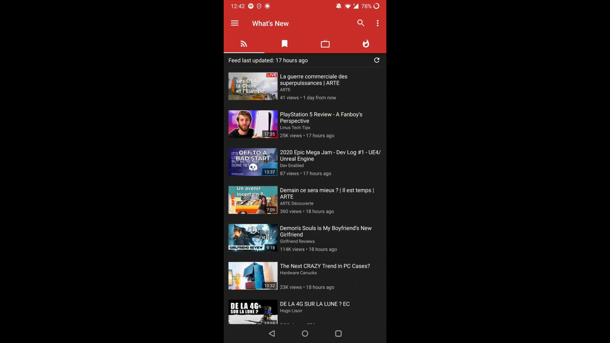
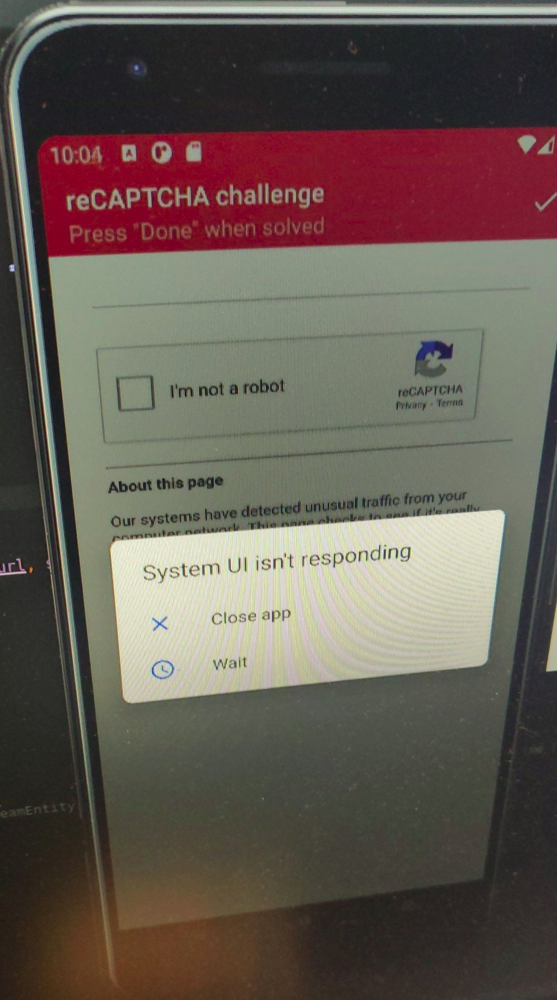

# Open Source Contribution Project
*Author :* Hugo Lloreda

*Date :* December 2020

*NOMA :* 10432000

*Project :* [NewPipe](https://github.com/TeamNewPipe/NewPipe)

## Finding a project to contribute to

It's the beginning of December, I haven't found the time to contribute to a project, mea culpa I should have done this in the first few weeks when there wasn't much to hand in. However, I already had some project in mind for which I would like to contribute: 

### Giara 
I heard about it on one of the subreddit that I am following [r/Linux](https://www.reddit.com/r/linux/comments/j2hqmi/giara_is_a_reddit_app_and_its_finally_sorta/). [Giara](https://gitlab.gnome.org/World/giara) is a fairly recent project, so it involves a smaller community, it is developed by one of the developers of Gnome. 
I was particularly interested in this project because I would like to see in the future Linux smartphones supporting the applications I use regularly. There are already Linux Smartphones, the most famous are [Pinephone](https://www.pine64.org/pinephone/) (very affordable) and [Librem 5](https://puri.sm/products/librem-5/) (very (too?) expensive).

So, I had planned to play my part to try to move forward with this ecosystem (the distributions that we know: Fedora, Ubuntu, Manjaro, ... with the applications I use on a daily basis in a Smartphone). However, looking at the different issues of Gitlab, I realized that the requested changes would be quite consequent, so I moved on to the other project I had in mind.

### Newpipe

It's an application that I use very regularly, it's an alternative to the Youtube application that is respectful of privacy and that allows you to upload videos, to have a popup of the video to "be able" to do several things at the same time. The community of this project is larger than the previous one.

 

## My contribution

## Find an issue

So I start looking for "Good first issue" labeled issues and I saw an issue that catched my attention (having already encountered the same problem) : if we refresh the video feed of our subscriptions, and we delete a video from one of our playlists, the application crashes.

A Gif representing the problem can be seen below : 

## Gather informations given by the community

So I looked at the [issue](https://github.com/TeamNewPipe/NewPipe/issues/4874) that had been opened on this subject, and I have seen that the crash was normally quite easy to reproduce, which is a good thing if you want to be able to target the components of the "failing" application of a code you know nothing about.

## Fork, clone and problems

I start cloning my fork, my IDE started working, trying to build the application but I got my first error which was a dependency problem, I didn't understand where this error was coming from, I searched in the documentation provided by Newpipe, everything seemed to be well set up. I spend some time looking for a solution, fortunately some comments on StackOverflow mention the Android Studio SDK Manager that would be at fault, I changed the Android version to take into account previous versions: Android 9 and 10 and I applied the change. The IDE started downloading all the missing dependencies (first victory!).

Now that it's possible to build and run the application, I dealt with the problem.

## Issue and problem (again ?!)

I took a quick look at the [documentation](https://teamnewpipe.github.io/documentation/) available unfortunately it didn't get me very far for the problem I wanted to fix, the documentation explained how to extend the application to add a service.

So I started trying to see which components of the code would be affected by this problem, I thought of course of the Playlist but also of the part that refreshes the feed of our subscriptions since it's these two actions that cause the crash of the application.

At first glance nothing struck me, so I decided to test using android Studio, that's where my computer made me understand that the task was going to be complicated, indeed the emulator took almost all the resources that my computer has, so I end up with a computer that has trouble responding. However, I managed to reproduce the crash, and I thought to myself "now I just have to launch in debug mode to have a lot of information", second big mistake, the application took a long time just to launch, I understood that I will have to do otherwise.

So I relied on the Sout (= System.out.println()) and I noticed that there was a comparison of memory addresses instead of comparing the values of the two objects, so I overrided the 'equals' method of the concerned class and I tested my solution, I didn't see the problem afterwards. However, this crash was quite random because sometimes the memory addresses matched, which made debugging more difficult.

## My contribution

Once the fix was pushed on my repo and tested many times to make sure the problem was fixed (so much so that Google was starting to wonder what was happening on my network), I look at the guidelines for making a [contribution](https://github.com/TeamNewPipe/NewPipe/blob/dev/.github/CONTRIBUTING.md) in the standards. My contribution answering the different points so I send my Pull Request. 

:warning: to the eyes, photo can hit the most sensitive eyes ***to bad quality photos***.

## Feedback

The next day, I saw that contributors had commented on my Pull Request. They advised me to improve the fix by using a special class of Kotlin (Newpipe is using Java but also Kotlin) called [Data Class](https://kotlinlang.org/docs/reference/data-classes.html) (this is not the pattern). This data class implements by default the "equals", "hashcode", ... methods. (so no comparison of memory addresses as opposed to Java's default behavior of the method equals), which greatly simplifies my solution (which was about ten lines long), which in the end amounts to modifying only one line of the initial code.

Before applying the suggestion, I had a doubt about how to apply it, so I asked which of the solutions I thought he was referring to in his message, and the contributor answered shortly after my comment. So I applied the suggestion and asked for a new review of the RP, now I just have to wait for the Merge or a last comment from a contributor.

## Conclusion

After finishing my first contribution, it makes me want to do more and fix other problems (at least when I have the time to do so) but I'm looking forward to taking part in this project that is important to me and making a small place for myself in this community.

What I particularly appreciated with this contribution is that it is also an exchange, knowing practically nothing about Kotlin, I did not know that it was possible to do the same thing with just one more word.

And it's a nice feeling to say that you have improved an application that you use practically every day.