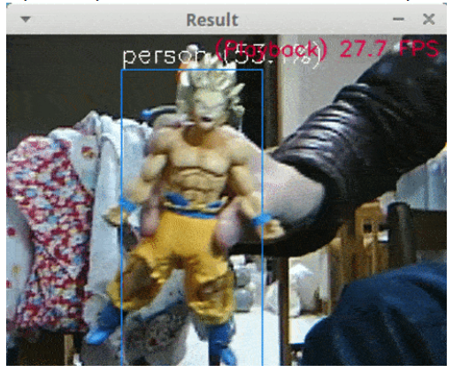
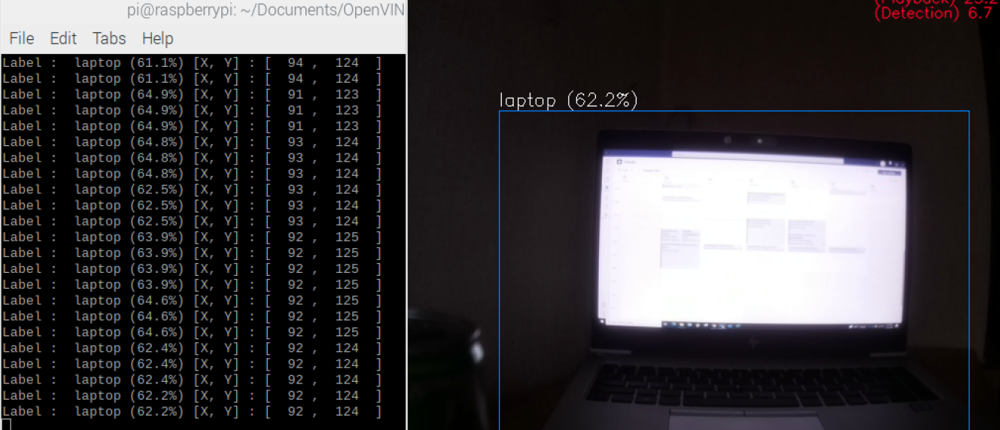

# Open Source Contribution Project

*Author:* Aqsa Ghaffar 

*Year:* 2021-2022 

*NOMA:* 87091800 

*Selected project:* [OpenVino-Yolov3](https://github.com/PINTO0309/OpenVINO-YoloV3)

*Pull request:* [pull reuest](https://github.com/PINTO0309/OpenVINO-YoloV3/pull/78)

## Finding a project 
For the realization of this work, I first had to choose a theme, an interesting project, not too simple but not too difficult either. In order to find the perfect project for this course as I had the experience with Open Source project analysis and I did work on ’JHotDraw’ analysis before. I decided to search on github and contribute into it for some extra features but JHotDraw was not available on Github.

## Project Selection 
Therefore, I started to look for another topic. At the same time I was working on my thesis ’Tracking objects with several cameras using deep learning on Raspberry Pi’ and I needed a ’YOLO algorithm’ project to start the research on object detection. I searched by putting keywords related to my thesis as I had to work on RaspberryPi I had to search for ‘OpenVino’ framework. I found this repository which was most interested for me. It was quite complex but I knew it would be helpful for my thesis also, if I contribute into it.

## Launching the Project 
In order to be able to launch the project on his computer, I could follow the description of the project which was relatively well done and clear. They had already explained the complete Environment construction procedure. But if you need to do it from the scratch you have to setup your raspberry pi by your own, which I already had prepared. 

## Contribution
In order to be able to contribute to the project, I obviously had to understand how the code works, read it in its entirety and look for features to add or improve. After running the code and after some fixes I was able to understand and decide what could be helpful to add and contribute. 
As I had my thesis goals it was not very difficult for me to decide. As in this project they are doing the Object detection. My next task was to do the Tracking for that we need the detected objects location and the class information. So I planned to work on it further. 

## Contacting the community 
I contacted a member labeled as a Developer and I asked him if I can work on it and do some contribution and I explained my idea to him. He was convinced but suggested me to try it and share the results before doing the pull request. 

## Making the contribution 
As in the project description, you can see the results they were getting like this

As I explained earlier, I added the code to print the Object’s location and class Id’s, which can be used later for the tracking purpose. and it gives the results like this. 

 
This information can be used later for tracking or other purpose. 

## Merging pull request 
I did modify only one file which was related to my system environment. After testing and verifying the functionality of my implementation, I shared the results with the contributor and he asked me to make a pull request so that my functionality could be introduced into the original code. The owner of the project seemed pleased with my work. I sent my pull request and the owner accepted it, merging my code into the project. 
I
n the end, it was very interesting to contribute for the first time to such an open-source project. 

## Conclusion
It was a lot of fun discovering this project. I am still frustrated I could not help on the first one since it was really what I wanted to do initially, which I had already done the critical analysis on that and knew where we can fix it or add additional features. 
Regarding the contribution for my other project it was really helpful. In a way it helped me for my thesis research and it helped me to realize that contributing to this kind of projects require at least a small experience on working in such an environment but the environment setup is very time-consuming. 

Moreover, the community was really kind and supportive to achieve this project so there is no fear to have in bothering the developers. I’m glad that I’ve done this open source contribution, because I couldn’t have learned better how to contribute otherwise and because it satisfies me a lot to think I helped (even if it was a minor contribution). Maybe I will comeback in the future to contribute again to this when I will finish my thesis.
