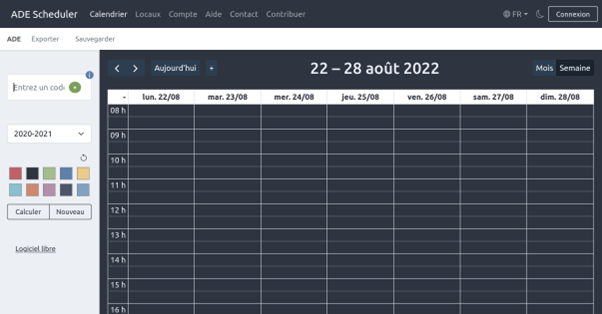
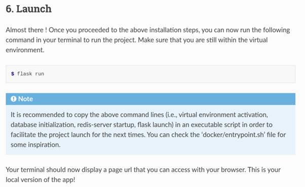

# Open Source Contribution Project

Author : Laurent DELEU

Noma : 60401300

Academic year : 2021-2022

Project : [ADE Scheduler](https://github.com/ADE-Scheduler/ADE-Scheduler)

License : MIT

## Topic Selection

As explained in my project plan, my original pick was [Keras](https://github.com/keras-team/keras), a Python package for machine learning tools. However, I realized that I didn’t have enough skills to find any issue or solve some already spotted one. I therefore drew my interest to another project : [ADE Scheduler](https://github.com/ADE-Scheduler/ADE-Scheduler). Indeed, I had realized earlier on the absence of a Dark mode option on the website. As implementing one should require front-end skills only and as I got some experience during the software engineering project course (linfo2255), I decided to give it a trial.

## Mission
The main objective is to add a Moon/Light button that should turn all pages to dark/light theme. Some later improvements could be to save the mode preference for the user account or use the browser mode as default value. These are the steps of the development:
1.	Installation and project repository forking, cloning and branching
2.	Learn about Boostrap
3.	Dark mode theme creation
4.	Moon/sun button addition on the navigation bar
5.	Linking the button pressing event with the button icon and mode switch
6.	Passing tests
7.	Pull request

## Issues

I quicky encountered difficulties, starting with a tedious installation. It took me several hours before understanding that some warning and error messages could be ignored (as I’m only focusing on the front-end). I also didn’t understand how to run the project, until I found some hidden script in the repository containing the searched command.

Once the installation proceeded, I could create the button but it wouldn’t show up on several page. I also realized that the colors and themes Boostrap implementation actually makes things inflexible. Therefore, I couldn’t create a single variable that would toggle the mode. Up to this day, the situation hasn’t evolved… Here is an illustration of what I could already display :

## Contribution

As I couldn’t propose even a minimalist working version of my feature, I decided to contribute in another way : improving the installation tutorial. Remembering I was lost when having to run the project, I wrote down a dedicated additional section which gives the command line to use, as well as tips to facilitate and accelerate the launch for developers.

I sent the [pull request](https://github.com/ADE-Scheduler/ADE-Scheduler/pull/878) on August 29th 2022 and one of the project creators answered a few minutes after. He suggested me some small changes that I committed. He also added a few screenshots to illustrate my explanations. The pull request was finally merged and closed on the same day. The result is the “6. Launch” section of the following [setup tutorial](https://ade-scheduler.readthedocs.io/en/latest/tutorials/setup.html) (the server might not have been updated by the time you read this report).

In addition, I also sent a mail to the creators concerning my issues when dealing with Bootstrap. One other creator confirmed that it wasn’t possible to use a single variable as “it's hard-coded CSS...” . He still gave me a useful link that may help me in the case I would keep on working on the feature.

## Conclusion

Contributing to an opensource project is not easy, even when working on a portion of it only (front-end). You still need to understand the connections with other files and respect the coding style which can bring to limitations (bootstraps). But most importantly: you need some skills. Something I underestimated twice : once with Keras and then with ADE Schedule. However, I also noticed that contributing (even in the smallest way) is satisfying for the contributor as well as for the creators who see the popularity of their project.
