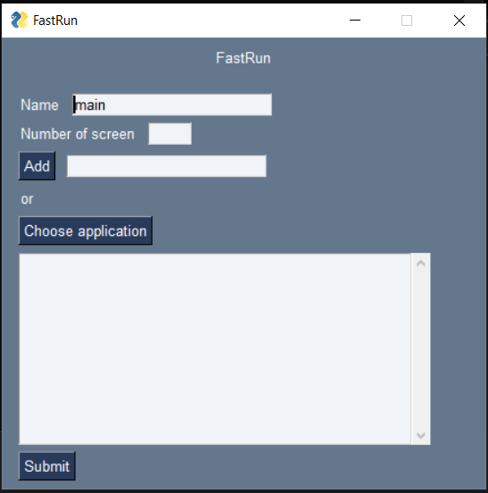

# Open Source Contribution Project

*Author:* Lambert Ugo

*NOMA:* 01071700

*Year:* 2021

*Selected project:*  [Python-project-Scripts](https://github.com/larymak/Python-project-Scripts)

# Chapitre 1 : La Recherche

Afin de trouver trouver le projet open-source qui me convient, j'ai réfléchit à quel outils/logiciels j'utilise tout les jours. 

J'ai tout d'abord pensé à Spotify et voulu contribuer au projet [SpotDL](https://github.com/spotDL/spotify-downloader) qui permet de télécharger ses playlist spotify depuis Youtube. Mais en parlant avec la communauté, j'ai appris que le projet etait considéré comme terminé. 

Ensuite, j'ai voulu contribuer au projet [RetroPie](https://github.com/RetroPie/RetroPie-Setup) car j'adore ce projet et je l'utilise beaucoup. C'est une distribution logicielle de retrogaming exploitant Raspbian. Mais malheureusement, ce projet est très loin de mon champs de compétence. 

Pour finir j'ai pensé à [Scrapy](https://github.com/scrapy/scrapy). Ces dernières années, j'ai beaucoup utilisé cette librairie que je trouve formidable dans mes projets personnel. Elle permet de faire du web-scraping facilement en python. Malgré mon envie de participer à ce projet, je ne trouvais pas de problème intérresant à regler, de fantastique feature à implémenter. 

C'est alors que je trouve sur github, un projet particulièrement attrayant. Le projet [Python-project-Scripts](https://github.com/larymak/Python-project-Scripts). Ce projet a pour but de promouvoir et donner accès à des scripts python pour débutant afin de les aider dans leur apprentissage. J'ai donc décider de jeter mon dévolu sur lui.

# Chapitre 2 : Démarage

J'ai commencé par regarder quels étaient les différents scripts python qui avait déjà été publié sur le projet. Beaucoup de très bon scripts était déjà présent tel qu'un bot Instagram, un convertisseur de code morse, un générateur de mot de passe, ...
Je commence donc à réfléchir quel script j'aimerais partagé et quel problème je pourrais régler grâce à celui-ci afin qu'il soit le plus utile possible pour les autres.

Une idée me vient alors. A chaque fois que je commence à étudier ou à coder, je lance toujours la même liste d'application sur plusieurs bureau différent. Par exemple, Spotify sur le premier bureau, Visual Studio Code sur le second et Chrome sur le troisième. Avec un tel script, il serait possible en 1 clic de lancer les 3 application sur différent bureaux.

Je vérifie que personne sur le projet n'ai publié un tel script et ... rien. J'examine alors le guide pour faire une contribution et commence à coder.

# Chapitre 3 : Création

J'identifie les différents problèmes auxquels je vais faire face pour réaliser le script.
- Ouvrir une application
- Changer de bureau
- Sauvegarder la routine crée

L'ouverture d'une application fut le probleme le plus facile à résoudre. Une fois le lien de l'executable obtenu, on peut le lancer comme un simple processus.

Ensuite, quelques recherche on été nécessaire pour trouver le moyen de changer de bureau. Je trouve alors enfin quelqu'un qui avait le même problème que moi sur [StackOverflow](https://stackoverflow.com/questions/60879235/python-windows-10-launching-an-application-on-a-specific-virtual-desktop-envir).

Enfin, je voulais que l'on puisse sauvegarder sa routine et qu'on puisse en avoir plusieurs. J'ai résolus ce soucis en sauvegardant chaque routine dans un fichier sous un un nom de routine. Lors de la sauvegarde, un petit fichier bash est crée pour lancer la routine grâce au script python et un raccourci est ajouté sur le bureau de l'utilisateur pour la lancer.

Le script était enfin prêt. Je l'ai adapté pour que l'on puisse l'utiliser par un terminal de commande. Tout fonctionnait à la perfection. Mais je n'était pas satisfait ...

# Chapitre 4 : L'interface

Le script fonctionnait comme je le souhaitais mais je ne le trouvais pas agréable à utiliser par commande. De plus, personne ne l'utiliserait si il n'était pas beau et compréhensible par les plus néophytes.
Je me suis donc atteler à faire une simple interface en python pour mieux utiliser le programme. 

Pour se faire, j'ai utilisé la librairie PySimpleGUI. J'ai alors designer un petite interface agréable à utiliser et qui facilite l'utilisation du script.

# Chapitre 5 : La contribution

Je poste le script après quelques mise en forme tels que le *README* avec les explications.
Après quelques heures de stress, le script est accepté par le modérateur et est fusionner avec le reste du projet.

J'espere que d'autres seront intérressé par ce script est y apporterons des améliorations.